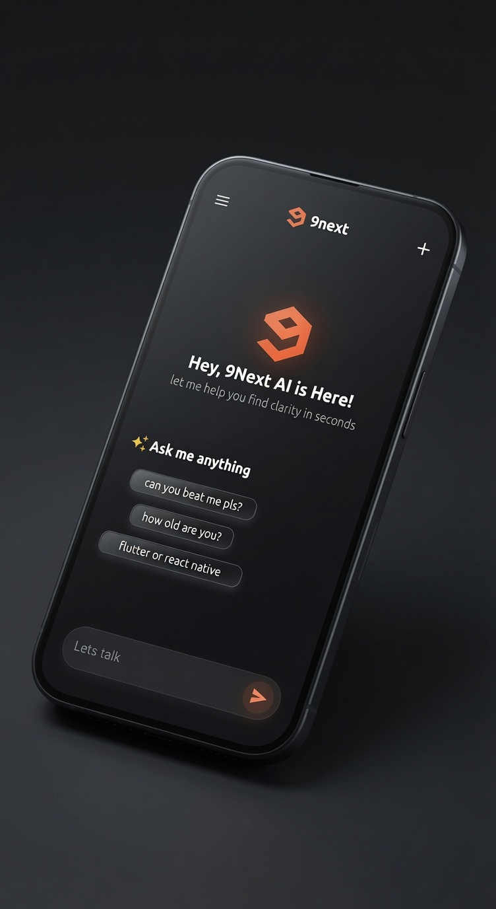

# Flutter UI Templates

## Modern • Responsive • Open Source

A curated collection of modern Flutter UI templates built for learning, inspiration, and portfolio purposes.

Every project is a standalone Flutter application with clean architecture, reusable widgets, and responsive layouts.

---

## Projects

### Chatbot UI

| Preview |
|---------|
| |
|  🔗 https://github.com/mr-command/chatbot_ui   |

### Authentication UI

| Preview |
|---------|
|  |
|  🔗 https://github.com/mr-command/Authentication-ui   |

---

## Design Principles

- Material 3
- Responsive Layout
- Reusable Widgets
- Clean Code
- Modern UI
- Smooth Animations

---

## Tech Stack

- Flutter
- Dart

---

## Repository Structure

Each UI template lives in its own GitHub repository.

This repository acts as an index to all available projects.

---

### this README is getting bigger.
